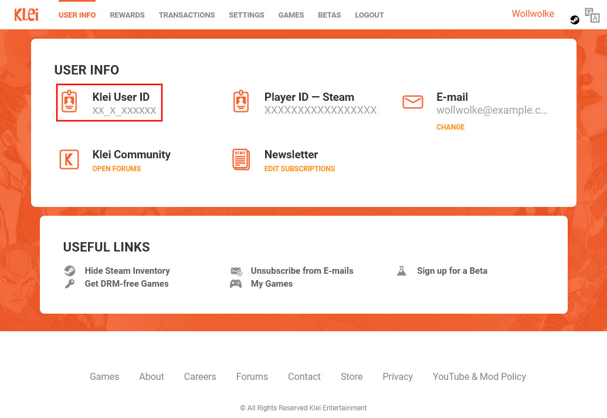

# DST Server Setup Guides

## Acquire Cluster Token

The server will not run without the cluster token. It can be generated in two ways: In-game and in a web browser.

**Generate it in-game:**

- Start the game and wait for the login
- Open the console (by pressing `~`) and enter:

```
TheNet:GenerateClusterToken()
```

A `cluster_token.txt` file was generated in:

- Unix: `~/.klei/DoNotStarveTogether`
- Windows: `C:\Users\<username>\Documents\Klei\DoNotStarveTogether`

**Generate it in a web browser:**

- Open the [Klei gameserver page](https://accounts.klei.com/account/game/servers?game=DontStarveTogether)
- Choose a cluster name (doesn't have to match the one in the compose file) and click `"Add New Server"`
- The cluster token is shown in the overview

> ⚠️ The account that generates the token will automatically be given in-game admin privileges, allowing you to roll back, regenerate the world, or use console commands while playing.

## Get Your Klei-ID

The Klei-ID can be queried in two ways: In-game and in a web browser.

**Get it in-game:**

- Start the game and wait for the login
- Press the Account button on the bottom left
- Your Klei User ID is shown

**Get it in a web browser:**

- Open the [Klei account page](https://accounts.klei.com/account/info)
- Your Klei User ID is shown

**Screenshot:**

